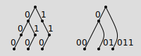
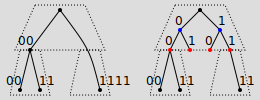
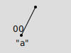
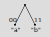

# Sparse Merkle Tree

## Path Compression

The aggregation tree in Unicity is a sparse Merkle tree (SMT) maintained in the "compressed paths" form. This means that generally only non-empty leaves and only parent nodes with two child nodes are kept explicitly. (The root node is an exception in that it may have only one or even zero child nodes.)

The figure below shows a tree with all non-empty nodes retained (on the left) and the same tree with path compression applied (on the right). In both cases, each edge is labelled with the description of the path from the child node to the parent node.



The hash value of a leaf node is `hash(path, data)` where `path` is the label on the edge connecting the node to its parent. The hash value of a non-leaf node (also called a branch node) is `hash(path, left, right)` where `path` is the label on the edge connecting the node to its parent and `left` and `right` are the hash values of the child nodes. For hashing the root node, the `path` is taken to be an empty (zero-length) bit-string.

## Inclusion Proofs

The inclusion proof for any leaf can be presented as a sequence of `(path, data)` pairs. The first pair in the sequence contains the `path` and `data` arguments from the `hash(path, data)` expression of the leaf node's hash value. In each of the subsequent pairs, the `path` element is the `path` argument from the `hash(path, left, right)` expression of the next node on the path from the leaf to the root, and the `data` element is the "sibling" hash value. That is, if the starting leaf is in the left sub-tree of the branch node, then `data` contains the `right` argument from the corresponding `hash(path, left, right)` expression, and vice versa.

Suppose the inclusion proof for some leaf node is `(path[1], data[1]), (path[2], data[2]), ..., (path[N], data[N])`. It's easy to verify that the root hash of the tree can then be recomputed as follows:

- `hash[1] = hash(path[1], data[1])`
- if the rightmost bit of `path[1]` is 0, then \
   `hash[2] = hash(path[2], hash[1], data[2])`, else \
   `hash[2] = hash(path[2], data[2], hash[1])` \
- ...
- if the rightmost bit of `path[N-1]` is 0, then \
   `hash[N] = hash(path[N], hash[N-1], data[N])`, else \
   `hash[N] = hash(path[N], data[N], hash[N-1])`

If, after these steps, `hash[N]` matches the root hash of the tree, this proves that the leaf with the path to root equal to `path[1] + path[2] + ... + path[N]` indeed contained `data[1]` in the SMT from which the sequence was extracted.

## Sharding

In sharded setting, the key space is partitioned according to a fixed number of bits of the key. This way, each shard aggregator manages a sub-tree (the two lower dashed boxes in each of the figures below) and the parent aggregator joins the sub-trees into a single tree (the higher dashed boxes).



The root nodes of the shard trees are the leaf nodes of the parent tree. To present a stable interface to the shard aggregators, the parent aggregator's tree is not really a sparse one. Instead, it has all the leaves present, and as a corollary also all the internal nodes (as shown on the right in the figure above), even if some leaves are null because there are no entries in the corresponding shard tree. The latter will not happen in practice, because there is no need to shard a tree that has so few entries, but is defined here for completeness of specification.

To facilitate generation of the inclusion proofs as described in the previous section, each shard aggregator computes its root hash as `hash(p, left, right)`, where `p` is the 1-bit "path" consisting of the rightmost bit of its shard identifier. Because the rightmost bit of the shard identifier determines whether the shard's root hash is the left or the right child of its parent node in the parent aggregator's tree, this yields the same value as if the parent aggregator had computed the whole tree by itself.

Note that the inclusion proof extracted from the parent aggregator's tree can't be verified following the steps shown in the previous section. Instead, a slightly modified version would have to be used, because the values in the leaf nodes of the parent tree (shown in red in the figure above) already contain the hash values to be used as the `left` and `right` arguments in the `hash(path, left, right)` expressions of their parent nodes (shown in blue in the figure above). Therefore, the correct first step of the verification algorithm in this case is just `hash[1] = data[1]`.

However, clients of the Unicity service need not concern themselves with this distinction, because the shard aggregator combines the inclusion proof received from the parent aggregator with its own and the resulting complete inclusion proof delivered to clients can always be verified with the regular rule defined in the previous section.

## CBOR Serialization

For hashing and signing, data structures are serialized in Concise Binary Object Representation (CBOR, IETF RFC 8949) using the deterministic encoding rules (Sec. 4.2 of the RFC).

Tuples are encoded as CBOR arrays in the natural way: a tuple consisting of *N* elements is encoded as an *N*-element CBOR array. A missing value is encoded as the CBOR simple value `null`.

As there's no native bit-string type in CBOR, bit-strings are represented as follows:

- one 1-bit is prepended to the original bit-string;
- zero to seven 0-bits are prepended to the result of the previous step so that the total number of bits is a multiple of 8;
- the result of the previous step is encoded as a CBOR byte-string in the left-to-right, highest-to-lowest order.

For example, the 12-bit string `0101'1010'1111` is padded to the 16-bit string `0001'0101'1010'1111` and then encoded as the 3-byte sequence `0x42` (byte-string, length 2), `0x15` (the padding `0001` and the bits `0101`), `0xaf` (the bits `1010'1111`).

Hash values, although frequently defined as general bit-strings in cryptographic theory, in practice always have bit-lengths divisible by 8 and are encoded as simple CBOR byte-strings with no padding.

## Examples

### Singleton

A "singleton" tree consisting of a root node with no child nodes:


CBOR diagnostic notation: `[h'01', null, null]`

CBOR encoding, annotated:
```
83         # array(3)
   41      # bytes(1)
      01   # 0000'0001
   F6      # null
   F6      # null
```

```
sha256(83'4101'F6'F6) = 1e54402898172f2948615fb17627733abbd120a85381c624ad060d28321be672
```

#### Inclusion Proofs

No inclusion proof can be extracted from such a tree.

### Left Child Only

A tree consisting of a root node with a left child:



The only child has 2-bit key `00` and 1-byte value "a".

**Leaf Node**

CBOR diagnostic notation: `[h'04', h'61']`

CBOR encoding, annotated:
```
82         # array(2)
   41      # bytes(1)
      04   # 0000'0100
   41      # bytes(1)
      61   # "a"
```

```
sha256(82'4104'4161) = 973634e81de87e025343da667dc296872682b66b51432879999238aee6d0373c
```

**Root Node**

CBOR diagnostic notation: `[h'01', h'973634e81de87e025343da667dc296872682b66b51432879999238aee6d0373c', null]`

CBOR encoding, annotated:
```
83         # array(3)
   41      # bytes(1)
      01   # 0000'0001
   58 20   # bytes(32)
      973634E81DE87E025343DA667DC296872682B66B51432879999238AEE6D0373C
   F6      # null
```

```
sha256(83'4101'5820973634E81DE87E025343DA667DC296872682B66B51432879999238AEE6D0373C'F6) = ccd73506d27518c983860a47a6a323d41038a74f9339f5302798563cb168f12f
```

#### Inclusion Proof

The inclusion proof for the only leaf is \
`[h'04', h'61']` \
`[h'01', null]`

### Right Child Only

A tree consisting of a root node with a right child:


The only child has 2-bit key `11` and 1-byte value "b".

**Leaf Node**

CBOR diagnostic notation: `[h'07', h'62']`

CBOR encoding, annotated:
```
82         # array(2)
   41      # bytes(1)
      07   # 0000'0111
   41      # bytes(1)
      62   # "b"
```

```
sha256(82'4107'4162) = ea0c1acccbc165a448c4d60d05c0ee3184cb463e6212d5c8c7b5fabe1d70eba1
```

**Root Node**

CBOR diagnostic notation: `[h'01', null, h'ea0c1acccbc165a448c4d60d05c0ee3184cb463e6212d5c8c7b5fabe1d70eba1']`

CBOR encoding, annotated:
```
83         # array(3)
   41      # bytes(1)
      01   # 0000'0001
   F6      # null
   58 20   # bytes(32)
      EA0C1ACCCBC165A448C4D60D05C0EE3184CB463E6212D5C8C7B5FABE1D70EBA1
```

```
sha256(83'4101'F6'5820EA0C1ACCCBC165A448C4D60D05C0EE3184CB463E6212D5C8C7B5FABE1D70EBA1) = 5219d2dac90ad497a82a5231f10cffaf5a12dc65b762be39a6d739b4159136a3
```

#### Inclusion Proof

The inclusion proof for the only leaf is \
`[h'07', h'62']` \
`[h'01', null]`

### Two Leaves

A tree consisting of a root node with a left and a right child:



The left child has 2-bit key `00` and 1-byte value "a".
The right child has 2-bit key `11` and 1-byte value "b".

**Left Leaf**

CBOR diagnostic notation: `[h'04', h'61']`

CBOR encoding, annotated:
```
82         # array(2)
   41      # bytes(1)
      04   # 0000'0100
   41      # bytes(1)
      61   # "a"
```

```
sha256(82'4104'4161) = 973634e81de87e025343da667dc296872682b66b51432879999238aee6d0373c
```

**Right Leaf**

CBOR diagnostic notation: `[h'07', h'62']`

CBOR encoding, annotated:
```
82         # array(2)
   41      # bytes(1)
      07   # 0000'0111
   41      # bytes(1)
      62   # "b"
```

```
sha256(82'4107'4162) = ea0c1acccbc165a448c4d60d05c0ee3184cb463e6212d5c8c7b5fabe1d70eba1
```

**Root Node**

CBOR diagnostic notation: `[h'01', h'973634e81de87e025343da667dc296872682b66b51432879999238aee6d0373c', h'ea0c1acccbc165a448c4d60d05c0ee3184cb463e6212d5c8c7b5fabe1d70eba1']`

CBOR encoding, annotated:
```
83         # array(3)
   41      # bytes(1)
      01   # 0000'0001
   58 20   # bytes(32)
      973634E81DE87E025343DA667DC296872682B66B51432879999238AEE6D0373C
   58 20   # bytes(32)
      EA0C1ACCCBC165A448C4D60D05C0EE3184CB463E6212D5C8C7B5FABE1D70EBA1
```

```
sha256(83'4101'5820973634E81DE87E025343DA667DC296872682B66B51432879999238AEE6D0373C'5820EA0C1ACCCBC165A448C4D60D05C0EE3184CB463E6212D5C8C7B5FABE1D70EBA1) = 7d527038c3b55ec2e83ad309f4f3b464d3eb337932d150ca4a17d55a245cdf77
```

#### Inclusion Proofs

The inclusion proof for the left leaf: \
`[h'04', h'61']` \
`[h'01', h'ea0c1acccbc165a448c4d60d05c0ee3184cb463e6212d5c8c7b5fabe1d70eba1']`

The inclusion proof for the right leaf: \
`[h'07', h'62']` \
`[h'01', h'973634e81de87e025343da667dc296872682b66b51432879999238aee6d0373c']`

### Two Leaves, Sharded

A tree consisting of a root node with two leaves, managed as two shards with 1-bit identifiers `0` and `1`, respectively:


The left leaf has 2-bit key `00` and 1-byte value "a".
The right leaf has 2-bit key `11` and 1-byte value "b".

#### Left Shard

**Left Leaf**

CBOR diagnostic notation: `[h'02', h'61']`

CBOR encoding, annotated:
```
82         # array(2)
   41      # bytes(1)
      02   # 0000'0010
   41      # bytes(1)
      61   # "a"
```

```
sha256(82'4102'4161) = 2222ead87965dbd1046ff0f4d09f9901222b0426681d222aff2954d7f4dcc1d3
```

**Root Node**

CBOR diagnostic notation: `[h'02', h'2222ead87965dbd1046ff0f4d09f9901222b0426681d222aff2954d7f4dcc1d3', null]`

CBOR encoding, annotated:
```
83         # array(3)
   41      # bytes(1)
      02   # 0000'0010
   58 20   # bytes(32)
      2222EAD87965DBD1046FF0F4D09F9901222B0426681D222AFF2954D7F4DCC1D3
   F6      # null
```

```
sha256(83'4102'58202222EAD87965DBD1046FF0F4D09F9901222B0426681D222AFF2954D7F4DCC1D3'F6) = 256aedd9f31e69a4b0803616beab77234bae5dff519a10e519a0753be49f0534
```

#### Right Shard

**Right Leaf**

CBOR diagnostic notation: `[h'03', h'62']`

CBOR encoding, annotated:
```
82         # array(2)
   41      # bytes(1)
      03   # 0000'0011
   41      # bytes(1)
      62   # "b"
```

```
sha256(82'4103'4162) = 50e3c959cf3fc159f5138e4e2638003a5051ce62ab59dc4605ac8d7a069b35eb
```

**Root Node**

CBOR diagnostic notation: `[h'03', null, h'50e3c959cf3fc159f5138e4e2638003a5051ce62ab59dc4605ac8d7a069b35eb']`

CBOR encoding, annotated:
```
83         # array(3)
   41      # bytes(1)
      03   # 0000'0011
   F6      # null
   58 20   # bytes(32)
      50E3C959CF3FC159F5138E4E2638003A5051CE62AB59DC4605AC8D7A069B35EB
```

```
sha256(83'4103'F6'582050E3C959CF3FC159F5138E4E2638003A5051CE62AB59DC4605AC8D7A069B35EB) = e777763b4ce391c2f8acdf480dd64758bc8063a3aa5f62670a499a61d3bc7b9a
```

#### Parent

Root of left child: `256aedd9f31e69a4b0803616beab77234bae5dff519a10e519a0753be49f0534`

Root of right child: `e777763b4ce391c2f8acdf480dd64758bc8063a3aa5f62670a499a61d3bc7b9a`

**Root Node**

CBOR diagnostic notation: `[h'01', h'256aedd9f31e69a4b0803616beab77234bae5dff519a10e519a0753be49f0534', h'e777763b4ce391c2f8acdf480dd64758bc8063a3aa5f62670a499a61d3bc7b9a']`

CBOR encoding, annotated:
```
83         # array(3)
   41      # bytes(1)
      01   # 0000'0001
   58 20   # bytes(32)
      256AEDD9F31E69A4B0803616BEAB77234BAE5DFF519A10E519A0753BE49F0534
   58 20   # bytes(32)
      E777763B4CE391C2F8ACDF480DD64758BC8063A3AA5F62670A499A61D3BC7B9A
```

```
sha256(83'4101'5820256AEDD9F31E69A4B0803616BEAB77234BAE5DFF519A10E519A0753BE49F0534'5820E777763B4CE391C2F8ACDF480DD64758BC8063A3AA5F62670A499A61D3BC7B9A) = 413b961d0069adfea0b4e122cf6dbf98e0a01ef7fd573d68c084ddfa03e4f9d6
```

#### Inclusion Proofs

**Left Leaf**

The inclusion proof for the left shard's root from the parent aggregator: \
`[h'02', h'256aedd9f31e69a4b0803616beab77234bae5dff519a10e519a0753be49f0534']` \
`[h'01', h'e777763b4ce391c2f8acdf480dd64758bc8063a3aa5f62670a499a61d3bc7b9a']`

The inclusion proof segment for the left leaf from the shard aggregator: \
`[h'02', h'61']` \
`[h'02', null]`

The complete inclusion proof for the left leaf, obtained by concatenating the shard aggregator's proof and the parent aggregator's proof, except for the first step of the latter: \
`[h'02', h'61']` \
`[h'02', null]` \
`[h'01', h'e777763b4ce391c2f8acdf480dd64758bc8063a3aa5f62670a499a61d3bc7b9a']`

**Right Leaf**

The inclusion proof for the right shard's root from the parent aggregator: \
`[h'03', h'e777763b4ce391c2f8acdf480dd64758bc8063a3aa5f62670a499a61d3bc7b9a']` \
`[h'01', h'256aedd9f31e69a4b0803616beab77234bae5dff519a10e519a0753be49f0534']`

The inclusion proof segment for the left leaf from the shard aggregator: \
`[h'03', h'62']` \
`[h'03', null]`

The complete inclusion proof for the right leaf, obtained by concatenating the shard aggregator's proof and the parent aggregator's proof, except for the first step of the latter: \
`[h'03', h'62']` \
`[h'03', null]` \
`[h'01', h'256aedd9f31e69a4b0803616beab77234bae5dff519a10e519a0753be49f0534']`

### Four Leaves

A tree containing four leaves:


- A leaf with 3-bit key `000` and 1-byte value "a".
- A leaf with 3-bit key `100` and 1-byte value "b".
- A leaf with 3-bit key `011` and 1-byte value "c".
- A leaf with 3-bit key `111` and 1-byte value "d".

**Leaf "a"**

CBOR diagnostic notation: `[h'02', h'61']`

CBOR encoding, annotated:
```
82         # array(2)
   41      # bytes(1)
      02   # 0000'0010
   41      # bytes(1)
      61   # "a"
```

```
sha256(82'4102'4161) = 2222ead87965dbd1046ff0f4d09f9901222b0426681d222aff2954d7f4dcc1d3
```

**Leaf "b"**

CBOR diagnostic notation: `[h'03', h'62']`

CBOR encoding, annotated:
```
82         # array(2)
   41      # bytes(1)
      03   # 0000'0011
   41      # bytes(1)
      62   # "b"
```

```
sha256(82'4103'4162) = 50e3c959cf3fc159f5138e4e2638003a5051ce62ab59dc4605ac8d7a069b35eb
```

**Parent of "a" and "b"**

CBOR diagnostic notation: `[h'04', h'2222ead87965dbd1046ff0f4d09f9901222b0426681d222aff2954d7f4dcc1d3', h'50e3c959cf3fc159f5138e4e2638003a5051ce62ab59dc4605ac8d7a069b35eb']`

CBOR encoding, annotated:
```
83         # array(3)
   41      # bytes(1)
      04   # 0000'0100
   58 20   # bytes(32)
      2222EAD87965DBD1046FF0F4D09F9901222B0426681D222AFF2954D7F4DCC1D3
   58 20   # bytes(32)
      50E3C959CF3FC159F5138E4E2638003A5051CE62AB59DC4605AC8D7A069B35EB
```

```
sha256(83'4104'58202222EAD87965DBD1046FF0F4D09F9901222B0426681D222AFF2954D7F4DCC1D3'582050E3C959CF3FC159F5138E4E2638003A5051CE62AB59DC4605AC8D7A069B35EB) = 571b7ef9469e4516ecc628ac0e7bbfb9032d739bcd44613b3594f03c0b208a67
```

**Leaf "c"**

CBOR diagnostic notation: `[h'02', h'63']`

CBOR encoding, annotated:
```
82         # array(2)
   41      # bytes(1)
      02   # 0000'0010
   41      # bytes(1)
      63   # "c"
```

```
sha256(82'4102'4163) = 6338c7ad0dc943f4e31052cdf2e9751fcaee9ff50a3e1bda97c51e05e7e7c79f
```

**Leaf "d"**

CBOR diagnostic notation: `[h'03', h'64']`

CBOR encoding, annotated:
```
82         # array(2)
   41      # bytes(1)
      03   # 0000'0011
   41      # bytes(1)
      64   # "d"
```

```
sha256(82'4103'4164) = 3fb43b8e381a3d05470aa184c5695c938c7d7a5d43bd595a936b4dbc2539a669
```

**Parent of "c" and "d"**

CBOR diagnostic notation: `[h'07', h'6338c7ad0dc943f4e31052cdf2e9751fcaee9ff50a3e1bda97c51e05e7e7c79f', h'3fb43b8e381a3d05470aa184c5695c938c7d7a5d43bd595a936b4dbc2539a669']`

CBOR encoding, annotated:
```
83         # array(3)
   41      # bytes(1)
      07   # 0000'0111
   58 20   # bytes(32)
      6338C7AD0DC943F4E31052CDF2E9751FCAEE9FF50A3E1BDA97C51E05E7E7C79F
   58 20   # bytes(32)
      3FB43B8E381A3D05470AA184C5695C938C7D7A5D43BD595A936B4DBC2539A669
```

```
sha256(83'4107'58206338C7AD0DC943F4E31052CDF2E9751FCAEE9FF50A3E1BDA97C51E05E7E7C79F'58203FB43B8E381A3D05470AA184C5695C938C7D7A5D43BD595A936B4DBC2539A669) = b77a56cc8a7f0db572a2c95092b722dce4a9e3366d0832ebb0f4668bc942cf88
```

**Root Node**

CBOR diagnostic notation: `[h'01', h'571b7ef9469e4516ecc628ac0e7bbfb9032d739bcd44613b3594f03c0b208a67', h'b77a56cc8a7f0db572a2c95092b722dce4a9e3366d0832ebb0f4668bc942cf88']`

CBOR encoding, annotated:
```
83         # array(3)
   41      # bytes(1)
      01   # 0000'0001
   58 20   # bytes(32)
      571B7EF9469E4516ECC628AC0E7BBFB9032D739BCD44613B3594F03C0B208A67
   58 20   # bytes(32)
      B77A56CC8A7F0DB572A2C95092B722DCE4A9E3366D0832EBB0F4668BC942CF88
```

```
sha256(83'4101'5820571B7EF9469E4516ECC628AC0E7BBFB9032D739BCD44613B3594F03C0B208A67'5820B77A56CC8A7F0DB572A2C95092B722DCE4A9E3366D0832EBB0F4668BC942CF88) = 95005e568fdac5cc01a3a091c70ce89ab2da98c36b254dd2ddf29bd568c377ab
```

#### Inclusion Proofs

The inclusion proof for leaf "a" is \
`[h'02', h'61']` \
`[h'04', h'50e3c959cf3fc159f5138e4e2638003a5051ce62ab59dc4605ac8d7a069b35eb']` \
`[h'01', h'b77a56cc8a7f0db572a2c95092b722dce4a9e3366d0832ebb0f4668bc942cf88']`

The inclusion proof for leaf "b" is \
`[h'03', h'62']` \
`[h'04', h'2222ead87965dbd1046ff0f4d09f9901222b0426681d222aff2954d7f4dcc1d3']` \
`[h'01', h'b77a56cc8a7f0db572a2c95092b722dce4a9e3366d0832ebb0f4668bc942cf88']`

The inclusion proof for leaf "c" is \
`[h'02', h'63']` \
`[h'07', h'3fb43b8e381a3d05470aa184c5695c938c7d7a5d43bd595a936b4dbc2539a669']` \
`[h'01', h'571b7ef9469e4516ecc628ac0e7bbfb9032d739bcd44613b3594f03c0b208a67']`

The inclusion proof for leaf "d" is \
`[h'03', h'64']` \
`[h'07', h'6338c7ad0dc943f4e31052cdf2e9751fcaee9ff50a3e1bda97c51e05e7e7c79f']` \
`[h'01', h'571b7ef9469e4516ecc628ac0e7bbfb9032d739bcd44613b3594f03c0b208a67']`

### Four Leaves, Sharded

A tree containing four leaves, managed as four shards with 2-bit identifiers `00`, `10`, `01` and `11`, respectively (where the shards `10` and `01` are empty):


- A leaf with 4-bit key `0000` and 1-byte value "a".
- A leaf with 4-bit key `1100` and 1-byte value "b".
- A leaf with 4-bit key `0011` and 1-byte value "c".
- A leaf with 4-bit key `1111` and 1-byte value "d".

#### Left Shard

**Left Leaf**

CBOR diagnostic notation: `[h'04', h'61']`

CBOR encoding, annotated:
```
82         # array(2)
   41      # bytes(1)
      04   # 0000'0100
   41      # bytes(1)
      61   # "a"
```

```
sha256(82'4104'4161) = 973634e81de87e025343da667dc296872682b66b51432879999238aee6d0373c
```

**Right Leaf**

CBOR diagnostic notation: `[h'07', h'62']`

CBOR encoding, annotated:
```
82         # array(2)
   41      # bytes(1)
      07   # 0000'0111
   41      # bytes(1)
      62   # "b"
```

```
sha256(82'4107'4162) = ea0c1acccbc165a448c4d60d05c0ee3184cb463e6212d5c8c7b5fabe1d70eba1
```

**Root Node**

CBOR diagnostic notation: `[h'02', h'973634e81de87e025343da667dc296872682b66b51432879999238aee6d0373c', h'ea0c1acccbc165a448c4d60d05c0ee3184cb463e6212d5c8c7b5fabe1d70eba1']`

CBOR encoding, annotated:
```
83         # array(3)
   41      # bytes(1)
      02   # 0000'0010
   58 20   # bytes(32)
      973634E81DE87E025343DA667DC296872682B66B51432879999238AEE6D0373C
   58 20   # bytes(32)
      EA0C1ACCCBC165A448C4D60D05C0EE3184CB463E6212D5C8C7B5FABE1D70EBA1
```

```
sha256(83'4102'5820973634E81DE87E025343DA667DC296872682B66B51432879999238AEE6D0373C'5820EA0C1ACCCBC165A448C4D60D05C0EE3184CB463E6212D5C8C7B5FABE1D70EBA1) = a602dc13e4932c8d58196cdd34b44c44ff457323e7dcec9e5ea05d789bd28936
```

#### Right Shard

**Left Leaf**

CBOR diagnostic notation: `[h'04', h'63']`

CBOR encoding, annotated:
```
82         # array(2)
   41      # bytes(1)
      04   # 0000'0100
   41      # bytes(1)
      63   # "c"
```

```
sha256(82'4104'4163) = b7ebe6f7b287fe0c50cc082bf09e628e8e30d946e7dedb67eec858d3a4f40ecc
```

**Right Leaf**

CBOR diagnostic notation: `[h'07', h'64']`

CBOR encoding, annotated:
```
82         # array(2)
   41      # bytes(1)
      07   # 0000'0111
   41      # bytes(1)
      64   # "d"
```

```
sha256(82'4107'4164) = ae1b7d9907d68f05e67fe3ba78c3427b8907c747c547a915d0c4f94adcb5ce40
```

**Root Node**

CBOR diagnostic notation: `[h'03', h'b7ebe6f7b287fe0c50cc082bf09e628e8e30d946e7dedb67eec858d3a4f40ecc', h'ae1b7d9907d68f05e67fe3ba78c3427b8907c747c547a915d0c4f94adcb5ce40']`

CBOR encoding, annotated:
```
83         # array(3)
   41      # bytes(1)
      03   # 0000'0011
   58 20   # bytes(32)
      B7EBE6F7B287FE0C50CC082BF09E628E8E30D946E7DEDB67EEC858D3A4F40ECC
   58 20   # bytes(32)
      AE1B7D9907D68F05E67FE3BA78C3427B8907C747C547A915D0C4F94ADCB5CE40
```

```
sha256(83'4103'5820B7EBE6F7B287FE0C50CC082BF09E628E8E30D946E7DEDB67EEC858D3A4F40ECC'5820AE1B7D9907D68F05E67FE3BA78C3427B8907C747C547A915D0C4F94ADCB5CE40) = d1d4fd1c4b4e332427d726c39a2cea17ed4c59bff0458232ccb36199bb8849af
```

#### Parent

Root of left shard: `a602dc13e4932c8d58196cdd34b44c44ff457323e7dcec9e5ea05d789bd28936`

Root of right shard: `d1d4fd1c4b4e332427d726c39a2cea17ed4c59bff0458232ccb36199bb8849af`

**Parent of left and left-middle shards**

CBOR diagnostic notation: `[h'02', h'a602dc13e4932c8d58196cdd34b44c44ff457323e7dcec9e5ea05d789bd28936', null]`

CBOR encoding, annotated:
```
83         # array(3)
   41      # bytes(1)
      02   # 0000'0010
   58 20   # bytes(32)
      A602DC13E4932C8D58196CDD34B44C44FF457323E7DCEC9E5EA05D789BD28936
   F6      # null
```

```
sha256(83'4102'5820A602DC13E4932C8D58196CDD34B44C44FF457323E7DCEC9E5EA05D789BD28936'F6) = 35f40d28e65de3c8aef348674458aa5378e392c95a8e48519fb8765017ee578f
```

**Parent of right-middle and right shards**

CBOR diagnostic notation: `[h'03', null, h'd1d4fd1c4b4e332427d726c39a2cea17ed4c59bff0458232ccb36199bb8849af']`

CBOR encoding, annotated:
```
83         # array(3)
   41      # bytes(1)
      03   # 0000'0011
   F6      # null
   58 20   # bytes(32)
      D1D4FD1C4B4E332427D726C39A2CEA17ED4C59BFF0458232CCB36199BB8849AF
```

```
sha256(83'4103'F6'5820D1D4FD1C4B4E332427D726C39A2CEA17ED4C59BFF0458232CCB36199BB8849AF) = 4522af733fca7feedf59a44a738bf757367fc456d042156f5de46496fcedc329
```

**Root Node**

CBOR diagnostic notation: `[h'01', h'35f40d28e65de3c8aef348674458aa5378e392c95a8e48519fb8765017ee578f', h'4522af733fca7feedf59a44a738bf757367fc456d042156f5de46496fcedc329']`

CBOR encoding, annotated:
```
83         # array(3)
   41      # bytes(1)
      01   # 0000'0001
   58 20   # bytes(32)
      35F40D28E65DE3C8AEF348674458AA5378E392C95A8E48519FB8765017EE578F
   58 20   # bytes(32)
      4522AF733FCA7FEEDF59A44A738BF757367FC456D042156F5DE46496FCEDC329
```

```
sha256(83'4101'582035F40D28E65DE3C8AEF348674458AA5378E392C95A8E48519FB8765017EE578F'58204522AF733FCA7FEEDF59A44A738BF757367FC456D042156F5DE46496FCEDC329) = ee27435446dd026d9f6baca2033ebffe2d29d8948eb81bf9250f7512323c6cbc
```

#### Inclusion Proofs

**Leaf "a"**

The inclusion proof from the parent aggregator: \
`[h'02', h'a602dc13e4932c8d58196cdd34b44c44ff457323e7dcec9e5ea05d789bd28936']` \
`[h'02', null]` \
`[h'01', h'4522af733fca7feedf59a44a738bf757367fc456d042156f5de46496fcedc329']`

The inclusion proof from the shard aggregator: \
`[h'04', h'61']` \
`[h'02', h'ea0c1acccbc165a448c4d60d05c0ee3184cb463e6212d5c8c7b5fabe1d70eba1']`

The complete inclusion proof: \
`[h'04', h'61']` \
`[h'02', h'ea0c1acccbc165a448c4d60d05c0ee3184cb463e6212d5c8c7b5fabe1d70eba1']` \
`[h'02', null]` \
`[h'01', h'4522af733fca7feedf59a44a738bf757367fc456d042156f5de46496fcedc329']`

**Leaf "b"**

The inclusion proof from the parent aggregator: \
`[h'02', h'a602dc13e4932c8d58196cdd34b44c44ff457323e7dcec9e5ea05d789bd28936']` \
`[h'02', null]` \
`[h'01', h'4522af733fca7feedf59a44a738bf757367fc456d042156f5de46496fcedc329']`

The inclusion proof from the shard aggregator: \
`[h'07', h'62']` \
`[h'02', h'973634e81de87e025343da667dc296872682b66b51432879999238aee6d0373c']`

The complete inclusion proof: \
`[h'07', h'62']` \
`[h'02', h'973634e81de87e025343da667dc296872682b66b51432879999238aee6d0373c']` \
`[h'02', null]` \
`[h'01', h'4522af733fca7feedf59a44a738bf757367fc456d042156f5de46496fcedc329']`

**Leaf "c"**

The inclusion proof from the parent aggregator: \
`[h'03', h'd1d4fd1c4b4e332427d726c39a2cea17ed4c59bff0458232ccb36199bb8849af']` \
`[h'03', null]` \
`[h'01', h'35f40d28e65de3c8aef348674458aa5378e392c95a8e48519fb8765017ee578f']`

The inclusion proof from the shard aggregator: \
`[h'04', h'63']` \
`[h'03', h'ae1b7d9907d68f05e67fe3ba78c3427b8907c747c547a915d0c4f94adcb5ce40']`

The complete inclusion proof: \
`[h'04', h'63']` \
`[h'03', h'ae1b7d9907d68f05e67fe3ba78c3427b8907c747c547a915d0c4f94adcb5ce40']` \
`[h'03', null]` \
`[h'01', h'35f40d28e65de3c8aef348674458aa5378e392c95a8e48519fb8765017ee578f']`

**Leaf "d"**

The inclusion proof from the parent aggregator: \
`[h'03', h'd1d4fd1c4b4e332427d726c39a2cea17ed4c59bff0458232ccb36199bb8849af']` \
`[h'03', null]` \
`[h'01', h'35f40d28e65de3c8aef348674458aa5378e392c95a8e48519fb8765017ee578f']`

The inclusion proof from the shard aggregator: \
`[h'07', h'64']` \
`[h'03', h'b7ebe6f7b287fe0c50cc082bf09e628e8e30d946e7dedb67eec858d3a4f40ecc'`

The complete inclusion proof: \
`[h'07', h'64']` \
`[h'03', h'b7ebe6f7b287fe0c50cc082bf09e628e8e30d946e7dedb67eec858d3a4f40ecc'` \
`[h'03', null]` \
`[h'01', h'35f40d28e65de3c8aef348674458aa5378e392c95a8e48519fb8765017ee578f']`
