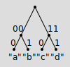

# Sparse Merkle Tree

## Path Compression

The aggregation tree in Unicity is an SMT (sparse Merkle tree) maintained in the "compressed paths" form. This means that only non-empty leaves and generally only parent nodes with two child nodes are kept explicitly. (A root node is the exception in that it may have only one or even zero child nodes.)

The figure below shows a tree with all non-empty nodes retained on the left and the same tree with path compression applied on the right. In both cases, each edge is labelled with the description of the path from the child node to the parent node.


The hash value of a leaf node is `hash(path, data)` where `path` is the label on the edge connecting the node to its parent. The hash value of a non-leaf node (also called a branch node) is `hash(path, left, right)` where `path` is the label on the edge connecting the node to its parent and `left` and `right` are the hash values of the child nodes.

## CBOR serialization

For hashing and signing, data structures are serialized in CBOR (Concise Binary Object Representation, IETF RFC 8949) using the deterministic encoding rules (Sec. 4.2 of the 8949).

Tuples are encoded as CBOR arrays in the natural way: a tuple `T` consisting of `N` elements, denoted `(T[1], T[2], ..., T[N])`, is encoded as an `N`-element CBOR array. A missing value is encoded as the CBOR simple value `null`.

Bit-strings are represented as follows:

- one 1-bit is prepended to the original bit-string;
- zero to seven 0-bits are prepended to the result of the previous step so that the total number of bits is a multiple of 8;
- the result of the previous step is encoded as a CBOR byte-string in the left-to-right, highest-to-lowest order.

For example, the 12-bit string `0101'1010'1111` is padded to the 16-bit string `0001'0101'1010'1111` and then encoded as a the 3-byte sequence `0x42` (byte-string, length 2), `0x15` (the padding `0001` and the bits `0101`), `0xaf` (the bits `1010'1111`).

Hash values, although frequently defined as general bit-strings in cryptographic theory, in practice always have bit-lengths divisible by 8 and are encoded as simple CBOR byte-strings with no padding.

## Examples

### Singleton

A "singleton" tree consisting of a root node with no child nodes:


CBOR diagnostic notation: `[h'01', null, null]`

CBOR encoding, annotated:
```
83       # array(3)
  41     # bytes(1)
    01   # 0000'0001
  F6     # null
  F6     # null
```

```
sha256(83'4101'f6'f6) = 1e54402898172f2948615fb17627733abbd120a85381c624ad060d28321be672
```

### Left Child Only

A tree consisting of a root node with a left child:


The only child has 2-bit key `00` and 1-byte value "a".

**Leaf Node**

CBOR diagnostic notation: `[h'04', h'61']`

CBOR encoding, annotated:
```
82         # array(2)
   41      # bytes(1)
      04   # 0000'0100
   41      # bytes(1)
      61   # "a"
```

```
sha256(82'4104'4161) = 973634e81de87e025343da667dc296872682b66b51432879999238aee6d0373c
```

**Root Node**

CBOR diagnostic notation: `[h'01', h'973634e81de87e025343da667dc296872682b66b51432879999238aee6d0373c', null]`

CBOR encoding, annotated:
```
83         # array(3)
   41      # bytes(1)
      01   # 0000'0001
   58 20   # bytes(32)
      973634E81DE87E025343DA667DC296872682B66B51432879999238AEE6D0373C
   F6      # null
```

```
sha256(83'4101'5820973634E81DE87E025343DA667DC296872682B66B51432879999238AEE6D0373C'F6) = ccd73506d27518c983860a47a6a323d41038a74f9339f5302798563cb168f12f
```

### Right Child Only

A tree consisting of a root node with a right child:


The only child has 2-bit key `11` and 1-byte value "b".

**Leaf Node**

CBOR diagnostic notation: `[h'07', h'62']`

CBOR encoding, annotated:
```
82         # array(2)
   41      # bytes(1)
      07   # 0000'0111
   41      # bytes(1)
      62   # "b"
```

```
sha256(82'4107'4162) = ea0c1acccbc165a448c4d60d05c0ee3184cb463e6212d5c8c7b5fabe1d70eba1
```

**Root Node**

CBOR diagnostic notation: `[h'01', null, h'ea0c1acccbc165a448c4d60d05c0ee3184cb463e6212d5c8c7b5fabe1d70eba1']`

CBOR encoding, annotated:
```
83         # array(3)
   41      # bytes(1)
      01   # 0000'0001
   F6      # null
   58 20   # bytes(32)
      EA0C1ACCCBC165A448C4D60D05C0EE3184CB463E6212D5C8C7B5FABE1D70EBA1
```

```
sha256(83'4101'F6'5820EA0C1ACCCBC165A448C4D60D05C0EE3184CB463E6212D5C8C7B5FABE1D70EBA1) = 5219d2dac90ad497a82a5231f10cffaf5a12dc65b762be39a6d739b4159136a3
```

### Two Leaves

A tree consisting of a root node with a left and a right child:


The left child has 2-bit key `00` and 1-byte value "a".
The right child has 2-bit key `11` and 1-byte value "b".

**Left Leaf**

CBOR diagnostic notation: `[h'04', h'61']`

CBOR encoding, annotated:
```
82         # array(2)
   41      # bytes(1)
      04   # 0000'0100
   41      # bytes(1)
      61   # "a"
```

```
sha256(82'4104'4161) = 973634e81de87e025343da667dc296872682b66b51432879999238aee6d0373c
```

**Right Leaf**

CBOR diagnostic notation: `[h'07', h'62']`

CBOR encoding, annotated:
```
82         # array(2)
   41      # bytes(1)
      07   # 0000'0111
   41      # bytes(1)
      62   # "b"
```

```
sha256(82'4107'4162) = ea0c1acccbc165a448c4d60d05c0ee3184cb463e6212d5c8c7b5fabe1d70eba1
```

**Root Node**

CBOR diagnostic notation: `[h'01', h'973634e81de87e025343da667dc296872682b66b51432879999238aee6d0373c', h'ea0c1acccbc165a448c4d60d05c0ee3184cb463e6212d5c8c7b5fabe1d70eba1']`

CBOR encoding, annotated:
```
83         # array(3)
   41      # bytes(1)
      01   # 0000'0001
   58 20   # bytes(32)
      973634E81DE87E025343DA667DC296872682B66B51432879999238AEE6D0373C
   58 20   # bytes(32)
      EA0C1ACCCBC165A448C4D60D05C0EE3184CB463E6212D5C8C7B5FABE1D70EBA1
```

```
sha256(83'4101'5820973634E81DE87E025343DA667DC296872682B66B51432879999238AEE6D0373C'5820EA0C1ACCCBC165A448C4D60D05C0EE3184CB463E6212D5C8C7B5FABE1D70EBA1) = 7d527038c3b55ec2e83ad309f4f3b464d3eb337932d150ca4a17d55a245cdf77
```

### Four Leaves

A tree containing four leaves:



- A leaf with 3-bit key `000` and 1-byte value "a".
- A leaf with 3-bit key `100` and 1-byte value "b".
- A leaf with 3-bit key `011` and 1-byte value "c".
- A leaf with 3-bit key `111` and 1-byte value "d".

**Leaf "a"**

CBOR diagnostic notation: `[h'02', h'61']`

CBOR encoding, annotated:
```
82         # array(2)
   41      # bytes(1)
      02   # 0000'0010
   41      # bytes(1)
      61   # "a"
```

```
sha256(82'4102'4161) = 2222ead87965dbd1046ff0f4d09f9901222b0426681d222aff2954d7f4dcc1d3
```

**Leaf "b"**

CBOR diagnostic notation: `[h'03', h'62']`

CBOR encoding, annotated:
```
82         # array(2)
   41      # bytes(1)
      03   # 0000'0011
   41      # bytes(1)
      62   # "b"
```

```
sha256(82'4103'4162) = 50e3c959cf3fc159f5138e4e2638003a5051ce62ab59dc4605ac8d7a069b35eb
```

**Parent of "a" and "b"**

CBOR diagnostic notation: `[h'04', h'2222ead87965dbd1046ff0f4d09f9901222b0426681d222aff2954d7f4dcc1d3', h'50e3c959cf3fc159f5138e4e2638003a5051ce62ab59dc4605ac8d7a069b35eb']`

CBOR encoding, annotated:
```
83         # array(3)
   41      # bytes(1)
      04   # 0000'0100
   58 20   # bytes(32)
      2222EAD87965DBD1046FF0F4D09F9901222B0426681D222AFF2954D7F4DCC1D3
   58 20   # bytes(32)
      50E3C959CF3FC159F5138E4E2638003A5051CE62AB59DC4605AC8D7A069B35EB
```

```
sha256(83'4104'58202222EAD87965DBD1046FF0F4D09F9901222B0426681D222AFF2954D7F4DCC1D3'582050E3C959CF3FC159F5138E4E2638003A5051CE62AB59DC4605AC8D7A069B35EB) = 571b7ef9469e4516ecc628ac0e7bbfb9032d739bcd44613b3594f03c0b208a67
```

**Leaf "c"**

CBOR diagnostic notation: `[h'02', h'63']`

CBOR encoding, annotated:
```
82         # array(2)
   41      # bytes(1)
      02   # 0000'0010
   41      # bytes(1)
      63   # "c"
```

```
sha256(82'4102'4163) = 6338c7ad0dc943f4e31052cdf2e9751fcaee9ff50a3e1bda97c51e05e7e7c79f
```

**Leaf "d"**

CBOR diagnostic notation: `[h'03', h'64']`

CBOR encoding, annotated:
```
82         # array(2)
   41      # bytes(1)
      03   # 0000'0011
   41      # bytes(1)
      64   # "d"
```

```
sha256(82'4103'4164) = 3fb43b8e381a3d05470aa184c5695c938c7d7a5d43bd595a936b4dbc2539a669
```

**Parent of "c" and "c"**

CBOR diagnostic notation: `[h'07', h'6338c7ad0dc943f4e31052cdf2e9751fcaee9ff50a3e1bda97c51e05e7e7c79f', h'3fb43b8e381a3d05470aa184c5695c938c7d7a5d43bd595a936b4dbc2539a669']`

CBOR encoding, annotated:
```
83         # array(3)
   41      # bytes(1)
      07   # 0000'0111
   58 20   # bytes(32)
      6338C7AD0DC943F4E31052CDF2E9751FCAEE9FF50A3E1BDA97C51E05E7E7C79F
   58 20   # bytes(32)
      3FB43B8E381A3D05470AA184C5695C938C7D7A5D43BD595A936B4DBC2539A669
```

```
sha256(83'4107'58206338C7AD0DC943F4E31052CDF2E9751FCAEE9FF50A3E1BDA97C51E05E7E7C79F'58203FB43B8E381A3D05470AA184C5695C938C7D7A5D43BD595A936B4DBC2539A669) = b77a56cc8a7f0db572a2c95092b722dce4a9e3366d0832ebb0f4668bc942cf88
```

**Root Node**

CBOR diagnostic notation: `[h'01', h'571b7ef9469e4516ecc628ac0e7bbfb9032d739bcd44613b3594f03c0b208a67', h'b77a56cc8a7f0db572a2c95092b722dce4a9e3366d0832ebb0f4668bc942cf88']`

CBOR encoding, annotated:
```
83         # array(3)
   41      # bytes(1)
      01   # 0000'0001
   58 20   # bytes(32)
      571B7EF9469E4516ECC628AC0E7BBFB9032D739BCD44613B3594F03C0B208A67
   58 20   # bytes(32)
      B77A56CC8A7F0DB572A2C95092B722DCE4A9E3366D0832EBB0F4668BC942CF88
```

```
sha256(83'4101'5820571B7EF9469E4516ECC628AC0E7BBFB9032D739BCD44613B3594F03C0B208A67'5820B77A56CC8A7F0DB572A2C95092B722DCE4A9E3366D0832EBB0F4668BC942CF88) = 95005e568fdac5cc01a3a091c70ce89ab2da98c36b254dd2ddf29bd568c377ab
```
