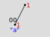
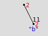

# Sum-Certifying Sparse Merkle Tree

## Contents

- [General Structure](#general)
- [Inclusion Proofs](#incl-proof)
- [Sharding](#sharding)
- [CBOR Serialization](#cbor)
- [Examples](#examples)
    - [Left Child Only](#left)
    - [Right Child Only](#right)
    - [Four Leaves](#four)

## General Structure <a name="general">

Sum-certifying Merkle trees in Unicity are implemented as an extension of sparse Merkle trees (SMT) where each node has an associated non-negative integer value; for a leaf node it's the value associated with the data in the leaf; for a non-leaf node it's the sum of values associated with the leaf nodes in its sub-tree.

The figure below shows a sum-certifying tree with all nodes labelled with their associated values and edges labelled with the descriptions of the paths.


The hash value of a leaf node is `hash(path, data, value)` where `path` is the label on the edge connecting the node to its parent. The hash value of a non-leaf node (also called a branch node) is `hash(path, left-hash, left-value, right-hash, right-value)` where `path` is the label on the edge connecting the node to its parent, `left-hash` and `right-hash` are the hash values of the child nodes, and `left-value` and `right-value` are the values associated with the child nodes. As with regular SMT, the `path` of the root node is taken to be an empty (zero-length) bit-string. The value associated with a `null` branch is 0.

## Inclusion Proofs <a name="incl-proof">

The inclusion proof for any leaf can be presented as a sequence of `(path, data, value)` triples. The first triple in the sequence contains the `path`, `data` and `value` arguments from the `hash(path, data, value)` expression of the leaf node's hash value. In each of the subsequent pairs, the `path` element is the `path` argument from the `hash(path, left-hash, left-value, right-hash, right-value)` expression of the next node on the path from the leaf to the root, the `data` element is the "sibling" hash value, and the `value` element is the value associated with the "sibling" node. That is, if the starting leaf is in the left sub-tree of the branch node, then `data` and `value` contain the `right-hash` and `right-value` arguments from the corresponding `hash(path, left-hash, left-value, right-hash, right-value)` expression, and vice versa.

Suppose the inclusion proof for some leaf node is `(path[1], data[1], value[1]), (path[2], data[2], value[2]), ..., (path[N], data[N], value[N])`. It's easy to verify that the root hash of the tree can then be recomputed as follows:

- `hash[1] = hash(path[1], data[1], value[1])`
- if `value[1]` is negative, fail with error
- `sum = value[1]`
- if the rightmost bit of `path[1]` is 0, then \
   `hash[2] = hash(path[2], hash[1], sum, data[2], value[2])`, else \
   `hash[2] = hash(path[2], data[2], value[2], hash[1], sum)`
- if `value[2]` is negative or `sum + value[2]` would overflow, fail with error
- `sum = sum + value[2]`
- ...
- if the rightmost bit of `path[N-1]` is 0, then \
   `hash[N] = hash(path[N], hash[N-1], sum, data[N], value[N])`, else \
   `hash[N] = hash(path[N], data[N], value[N], hash[N-1], sum)`
- if `value[N]` is negative or `sum + value[N]` would overflow, fail with error
- `sum = sum + value[N]`

If, after these steps, `hash[N]` matches the root hash of the tree, this proves that the leaf with the path to root equal to `path[1] + path[2] + ... + path[N]` indeed contained `data[1]` and had `value[1]`associated to it in the SMT from which the sequence was extracted, and the root node had the final value of `sum` associated to it.

## Sharding <a name="sharding">

We currently do not define sharding for sum-certifying trees.

## CBOR Serialization <a name="cbor">

We apply the same serialization rules to sum-certifying trees as to the regular SMTs.

The values associated with nodes of sum-certifying trees in Unicity may exceed the capacity of CBOR's native 64-bit unsigned integers. For that reason, and in the interest of uniformity of representation, the values in sum-certifying trees are always serialized as byte sequences, ordered from the most siginficant to the least significant bits (also known as big endian or network byte order), with leading zero bytes omitted (in particular, a zero value is serialized as a zero-length byte string). Note that, on the data level, there can be no negative values and no overflows, so the "`value[i]` is negative" and "`sum` + `value[i]` would overflow" conditions in the inclusion proof verification above are only to prevent exploitation of potential implementation limits.

## Examples <a name="examples">

### Left Child Only <a name="left">

A tree consisting of a root node with a left child:



The only child has 2-bit key `00`, 1-byte data "a", and associated value 1.

**Leaf Node**

CBOR diagnostic notation: `[h'04', h'61', h'01']`

CBOR encoding, annotated:
```
83         # array(3)
   41      # bytes(1)
      04   # 0000'0100
   41      # bytes(1)
      61   # "a"
   41      # bytes(1)
      01   # 1
```

```
sha256(83'4104'4161'4101) = 8c859cebfbfb0ccf8825e34b4420a4fe4fe5e7e38ab4ffeb2c08caa0a47a876d
```

**Root Node**

CBOR diagnostic notation: `[h'01', h'8c859cebfbfb0ccf8825e34b4420a4fe4fe5e7e38ab4ffeb2c08caa0a47a876d', h'01', null, h'']`

CBOR encoding, annotated:
```
85         # array(5)
   41      # bytes(1)
      01   # 0000'0001
   58 20   # bytes(32)
      8C859CEBFBFB0CCF8825E34B4420A4FE4FE5E7E38AB4FFEB2C08CAA0A47A876D
   41      # bytes(1)
      01   # 1
   F6      # null
   40      # bytes(0)
           # 0
```

```
sha256(85'4101'58208C859CEBFBFB0CCF8825E34B4420A4FE4FE5E7E38AB4FFEB2C08CAA0A47A876D'4101'F6'40) = 34e0cf342d70c0d10e3ba481f72db532ecfd723afa3c25812a4bef61b5198d0b
```

#### Inclusion Proof

The inclusion proof for the only leaf is \
`[h'04', h'61', h'01']` \
`[h'01', null, h'']`

### Right Child Only <a name="right">

A tree consisting of a root node with a right child:



The only child has 2-bit key `11`, 1-byte data "b", and associated value 2.

**Leaf Node**

CBOR diagnostic notation: `[h'07', h'62', h'02']`

CBOR encoding, annotated:
```
83         # array(3)
   41      # bytes(1)
      07   # 0000'0111
   41      # bytes(1)
      62   # "b"
   41      # bytes(1)
      02   # 2
```

```
sha256(83'4107'4162'4102) = fddfbf4eeffce911cfe275f3bda3bc980ffc7399466795e6aa0883896b99e63b
```

**Root Node**

CBOR diagnostic notation: `[h'01', null, h'', h'fddfbf4eeffce911cfe275f3bda3bc980ffc7399466795e6aa0883896b99e63b', h'02']`

CBOR encoding, annotated:
```
85         # array(5)
   41      # bytes(1)
      01   # 0000'0001
   F6      # null
   40      # bytes(0)
           # 0
   58 20   # bytes(32)
      FDDFBF4EEFFCE911CFE275F3BDA3BC980FFC7399466795E6AA0883896B99E63B
   41      # bytes(1)
      02   # 2
```

```
sha256(85'4101'F6'40'5820FDDFBF4EEFFCE911CFE275F3BDA3BC980FFC7399466795E6AA0883896B99E63B'4102) = da47d1cda8dab5159b2bed1ea27c3d24ed990989fac3c62ace05273fea51f958
```

#### Inclusion Proof

The inclusion proof for the only leaf is \
`[h'07', h'62', h'02']` \
`[h'01', null, h'']`

### Four Leaves <a name="four">

A tree containing four leaves:


- A leaf with 3-bit key `000`, 1-byte data "a", and associated value 1.
- A leaf with 3-bit key `100`, 1-byte data "b", and associated value 2.
- A leaf with 3-bit key `011`, 1-byte data "c", and associated value 3.
- A leaf with 3-bit key `111`, 1-byte data "d", and associated value 4.

**Leaf "a"**

CBOR diagnostic notation: `[h'02', h'61', h'01']`

CBOR encoding, annotated:
```
83         # array(3)
   41      # bytes(1)
      02   # 0000'0010
   41      # bytes(1)
      61   # "a"
   41      # bytes(1)
      01   # 1
```

```
sha256(83'4102'4161'4101) = 102c3dd2437c845924a6158d1b1bf5eb8fda6b4ebd31a5fdb5853c91ad463e8d
```

**Leaf "b"**

CBOR diagnostic notation: `[h'03', h'62', h'02']`

CBOR encoding, annotated:
```
83         # array(3)
   41      # bytes(1)
      03   # 0000'0011
   41      # bytes(1)
      62   # "b"
   41      # bytes(1)
      02   # 2
```

```
sha256(83'4103'4162'4102) = 92bea7854b2fdc2ea92dc4883de28e2f65ad0951775dbc581e890469e151881c
```

**Parent of "a" and "b"**

CBOR diagnostic notation: `[h'04', h'102c3dd2437c845924a6158d1b1bf5eb8fda6b4ebd31a5fdb5853c91ad463e8d', h'01', h'92bea7854b2fdc2ea92dc4883de28e2f65ad0951775dbc581e890469e151881c', h'02']`

CBOR encoding, annotated:
```
85         # array(5)
   41      # bytes(1)
      04   # 0000'0100
   58 20   # bytes(32)
      102C3DD2437C845924A6158D1B1BF5EB8FDA6B4EBD31A5FDB5853C91AD463E8D
   41      # bytes(1)
      01   # 1
   58 20   # bytes(32)
      92BEA7854B2FDC2EA92DC4883DE28E2F65AD0951775DBC581E890469E151881C
   41      # bytes(1)
      02   # 2
```

```
sha256(83'4104'5820102C3DD2437C845924A6158D1B1BF5EB8FDA6B4EBD31A5FDB5853C91AD463E8D'4101'582092BEA7854B2FDC2EA92DC4883DE28E2F65AD0951775DBC581E890469E151881C'4102) = 7c6a65b14cc47a426a05bd58cd302483d7088d8c150de74870926426fdd3e330
```

**Leaf "c"**

CBOR diagnostic notation: `[h'02', h'63', h'03']`

CBOR encoding, annotated:
```
83         # array(3)
   41      # bytes(1)
      02   # 0000'0010
   41      # bytes(1)
      63   # "c"
   41      # bytes(1)
      03   # 3
```

```
sha256(83'4102'4163'4103) = 92ca2511a1b233fbb9f2f20c8ba5f632aac562dcf499a9a267f1b2056895df91
```

**Leaf "d"**

CBOR diagnostic notation: `[h'03', h'64', h'04']`

CBOR encoding, annotated:
```
83         # array(3)
   41      # bytes(1)
      03   # 0000'0011
   41      # bytes(1)
      64   # "d"
   41      # bytes(1)
      04   # 4
```

```
sha256(83'4103'4164'4104) = bf10c571d601484075ebe4219eecaac4d2e7b706de0fa964e9af7c814c4e0640
```

**Parent of "c" and "d"**

CBOR diagnostic notation: `[h'07', h'92ca2511a1b233fbb9f2f20c8ba5f632aac562dcf499a9a267f1b2056895df91', h'03', h'bf10c571d601484075ebe4219eecaac4d2e7b706de0fa964e9af7c814c4e0640', h'04']`

CBOR encoding, annotated:
```
85         # array(5)
   41      # bytes(1)
      07   # 0000'0111
   58 20   # bytes(32)
      92CA2511A1B233FBB9F2F20C8BA5F632AAC562DCF499A9A267F1B2056895DF91
   41      # bytes(1)
      03   # 3
   58 20   # bytes(32)
      BF10C571D601484075EBE4219EECAAC4D2E7B706DE0FA964E9AF7C814C4E0640
   41      # bytes(1)
      04   # 4
```

```
sha256(85'4107'582092CA2511A1B233FBB9F2F20C8BA5F632AAC562DCF499A9A267F1B2056895DF91'4103'5820BF10C571D601484075EBE4219EECAAC4D2E7B706DE0FA964E9AF7C814C4E0640'4104) = c03b367b81c0525bd067b0ed55acddbab776eaafd9e0a931d65e21a2add5787e
```

**Root Node**

CBOR diagnostic notation: `[h'01', h'7c6a65b14cc47a426a05bd58cd302483d7088d8c150de74870926426fdd3e330', h'03', h'c03b367b81c0525bd067b0ed55acddbab776eaafd9e0a931d65e21a2add5787e', h'07']`

CBOR encoding, annotated:
```
85         # array(5)
   41      # bytes(1)
      01   # 0000'0001
   58 20   # bytes(32)
      7C6A65B14CC47A426A05BD58CD302483D7088D8C150DE74870926426FDD3E330
   41      # bytes(1)
      03   # 3
   58 20   # bytes(32)
      C03B367B81C0525BD067B0ED55ACDDBAB776EAAFD9E0A931D65E21A2ADD5787E
   41      # bytes(1)
      07   # 7
```

```
sha256(85'4101'58207C6A65B14CC47A426A05BD58CD302483D7088D8C150DE74870926426FDD3E330'4103'5820C03B367B81C0525BD067B0ED55ACDDBAB776EAAFD9E0A931D65E21A2ADD5787E'4107) = 00abf599f3fc4bd79271416d134450d3e3da8e2a42ad4b26f618c818a6e6b463
```

#### Inclusion Proofs

The inclusion proof for leaf "a" is \
`[h'02', h'61', h'01']` \
`[h'04', h'92bea7854b2fdc2ea92dc4883de28e2f65ad0951775dbc581e890469e151881c', h'02']` \
`[h'01', h'c03b367b81c0525bd067b0ed55acddbab776eaafd9e0a931d65e21a2add5787e', h'07']`

The inclusion proof for leaf "b" is \
`[h'03', h'62', h'02']` \
`[h'04', h'102c3dd2437c845924a6158d1b1bf5eb8fda6b4ebd31a5fdb5853c91ad463e8d', h'01']` \
`[h'01', h'c03b367b81c0525bd067b0ed55acddbab776eaafd9e0a931d65e21a2add5787e', h'07']`

The inclusion proof for leaf "c" is \
`[h'02', h'63', h'03']` \
`[h'07', h'bf10c571d601484075ebe4219eecaac4d2e7b706de0fa964e9af7c814c4e0640', h'04']` \
`[h'01', h'7c6a65b14cc47a426a05bd58cd302483d7088d8c150de74870926426fdd3e330', h'03']`

The inclusion proof for leaf "d" is \
`[h'03', h'64', h'04']` \
`[h'07', h'92ca2511a1b233fbb9f2f20c8ba5f632aac562dcf499a9a267f1b2056895df91', h'03']` \
`[h'01', h'7c6a65b14cc47a426a05bd58cd302483d7088d8c150de74870926426fdd3e330', h'03']`
